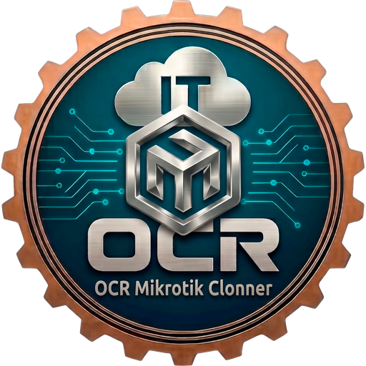

<p align="center">
  
</p>

<h1 align="center">OCR Mikrotik Clonner</h1>

<p align="center">
  Clona un MikroTik RouterOS entero —configuración, backup y certificados con sus claves—
  y lo despliega en otro equipo desde Windows, sin WinBox y sin SSH.<br>
  Un solo <code>.exe</code>, sin instalador y sin dependencias.
</p>

<p align="center">
  
  
  
</p>

---

## Para qué es

Sustituir un router MikroTik que ha muerto, o preparar uno de reserva idéntico, a las nueve
de la mañana y con el cliente parado. Se conecta al equipo, se lleva **todo** lo que hace
falta para replicarlo y lo vuelca en otro.

Dos pestañas:

- **Copiar configuración** — se conecta a un router en marcha y descarga a una carpeta local
  el backup binario (`/system backup save`, opcionalmente cifrado), el export legible
  (`/export file=`) y **todos** los certificados con sus claves privadas
  (`/certificate export-certificate`). Crea una subcarpeta `identidad_fecha`, la abre en el
  Explorador al terminar y, por defecto, **borra del router los ficheros que ha generado**:
  el backup y las claves no deben quedarse en su disco.
- **Configurar router** — restaura ese backup en el mismo equipo o en un modelo idéntico, o
  despliega la configuración portable (`.rsc` + certificados) en uno nuevo o reseteado.

No usa WinBox ni SSH: mueve los ficheros por **FTP** y ejecuta los comandos con el
**protocolo API nativo de RouterOS** (puerto 8728), implementado en .NET puro dentro del
propio EXE.

## Lo que lo diferencia de importar un .rsc a mano

**El `/import` de RouterOS aborta en la primera línea que falla.** Si el `.rsc` trae una
sección que el equipo destino no acepta, te quedas con un router a medio configurar —y a
veces sin firewall, que es peor que no haber hecho nada.

Aquí el `.rsc` se trocea en **secciones de primer nivel** (`/ip address`,
`/ip firewall filter`, …) que se importan una a una. Si una falla, se registra
(`OCR: FALLO en <sección>` en el `/log` del router) y **las demás se aplican igual**; el
fichero de la sección que ha fallado se conserva para diagnosticarla.

Con la casilla **«Reset de fábrica previo»** el trabajo lo hace el propio router: se le suben
los certificados, las secciones y un script `ocr_bootstrap.rsc` autogenerado, y se lanza
`/system reset-configuration no-defaults=yes keep-users=yes run-after-reset=ocr_bootstrap.rsc`.
Al arrancar limpio, el router importa sus certificados (cada comando con `:do on-error`, así
que ninguno tumba el resto), los renombra, importa las secciones y borra lo subido —incluida
la passphrase del bootstrap. No hace falta reconectar: tras un `no-defaults` el router no
tiene IP hasta que el script se la pone.

## Rescate por Telnet

Muchas configuraciones de producción dejan `api` y `ftp` deshabilitados, que es justo lo que
esta herramienta necesita. En vez de rendirse, detecta los puertos 21/8728 cerrados, **entra
por Telnet** (cliente propio en .NET), los habilita con `/ip service set ftp,api disabled=no`,
hace el trabajo y **los vuelve a deshabilitar al terminar**. «Probar conexión» tampoco deja
rastro.

Si un servicio está habilitado pero su puerto no responde, avisa de que puede haber
restricciones `address=`/`port=` o un firewall por medio, en vez de dar un error genérico.

## Requisitos

- **En el PC**: Windows con .NET Framework 4 (viene de serie desde Windows 8). No hay
  instalador ni dependencias: se descarga el `.exe` y se ejecuta.
- **En el router**: un usuario del grupo `full` (`admin` sirve) y, o bien `ftp` y `api`
  accesibles en `/ip service`, o bien `telnet` activo para que la herramienta los habilite
  sola.

Probado en un **RB1100AHx2** real con RouterOS 6.47.7, incluida una configuración con
servidor OpenVPN y sus certificados.

## Descarga

El ejecutable está en **[Releases](../../releases)**.

El EXE **no va firmado digitalmente** —no hay certificado de firma de código—, así que
SmartScreen avisará la primera vez: *Más información → Ejecutar de todas formas*. Las notas
de cada publicación incluyen el `SHA-256` del fichero; conviene comprobarlo:

```powershell
Get-FileHash .\OCRMikrotikClonner.exe -Algorithm SHA256
```

## Antes de usarlo, en serio

Restaurar un backup y el reset de fábrica **borran la configuración del equipo destino** y lo
reinician. Comprueba la IP, el equipo y el cliente antes de pulsar EJECUTAR, y ten una copia
previa.

Los ficheros que descarga —backup, export y certificados con clave privada— **son las llaves
de la red del cliente**. Guárdalos cifrados, con acceso restringido, y bórralos cuando dejen
de hacer falta.

Úsalo sólo sobre equipos cuya gestión tengas encomendada. Los términos completos están en el
enlace «Acerca de · Términos de uso» de la propia aplicación.

## Aviso

Herramienta interna de **OCR IT Support** que se publica por si le sirve a alguien más.
MikroTik y RouterOS son marcas de MikroTikls SIA; esta herramienta **no está afiliada ni
respaldada por MikroTik**. Se entrega **tal cual, sin garantía de ningún tipo**.

No lleva ningún componente de inteligencia artificial: no hay chat, ni asistente, ni
generación de texto. Todo lo que hace son comandos deterministas contra la API de RouterOS.
